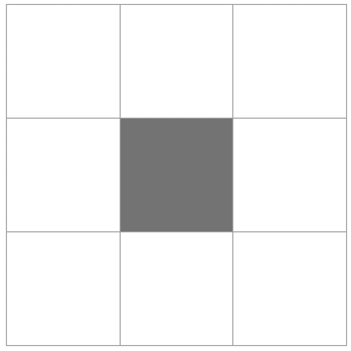

# Minesweeper Algorithm

> Solve minesweeper using some efficient heuristics.

## Sample Demonstration

* The below demonstration is done on a $16 \times 30$ board with $99$ bombs to be on par with the hardest difficulty on [speedrun.com](https://www.speedrun.com/minesweeper?h=Expert_w_RNG_Manipulation&x=9kvp16ek). The starting square is chosen to be $(2,2)$ for this example.
* Runs of the algorithm so far can be found in the `games/` folder.

## Algorithm Description

**Initial Conditions:**

* The starting square has already been revealed.

* Neighboring squares to the selected song also don't have bombs. This is primarily to increase the likelihood of not having to guess in the first few moves. In the below board, each neighboring square has a $\frac{\text{square number}}8$ chance which has a higher likelihood of failing compared to a $3\times3$ grid which can result in a couple of confirmed tiles while also giving the probability calculation algorithm.

  

* The algorithm is given the ability to mark bombs or reveal squares.

* The model is however not given access to where the bombs are through a filter which replaced bombs on the matrix with default squares.

**Iterative Solution Finding:**

1. While there are still confirmed squares possible.

   1. Identify safe squares.

      1. For each selected square, calculate the bombs remaining $\beta$, if $\beta =0$, then it means that the remaining neighbors are completely safe.

      $$
      \beta=\text{board number} - \Sigma \text{ neighbor bombs}
      $$

      1. Reveal these squares.

   2. Identify bombs.

      1. For each selected square, calculate $\beta$ and $n$, Where $\beta$ is the # of bombs remaining and $n$ is the number of squares remaining. If $\beta = n$, then the remaining squares are all bombs. Label them as such.

2. Probability Calculation.

   1. Identify the adjacent squares $\alpha$ to the currently selected square that are still selectable.
   2. Using the length of $\alpha$ to generate combinations of $\{\text{Labeled Bomb}, \text{Safe Square}\}^k$ where $k=len(\alpha)$. In each of these possibilities, substitute the number into the board to identify if the board is valid, accumulate the valid boards.
   3. Sum the valid boards row wise after replacing $\text{Labeled Bomb} \to 0, \text{Safe Square} \to 1$, divide by the length of valid boards to indicate the probability of each of the squares are most likely to be safe.
   4. Identify the maximum probability, if the value is 1, reveal all the indicies with matching probability, they are confirmed to be safe. However, if the probability is $< 0$, Choose one random square of the highest probability.
   5. Probability that is equal to 0 is confirmed to be a bomb, mark these as bombs.

* Repetition of this step will result in near perfect play while also mainting efficient calculation.

